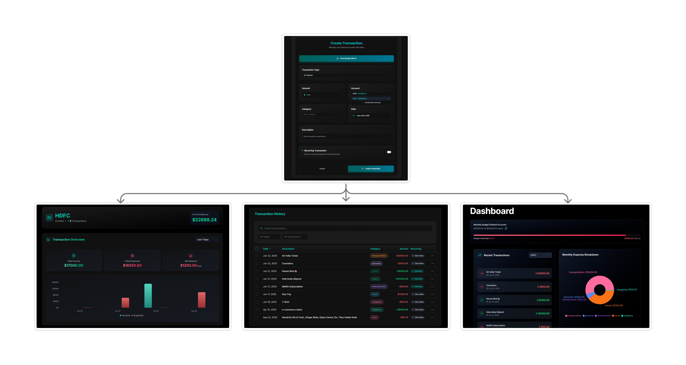
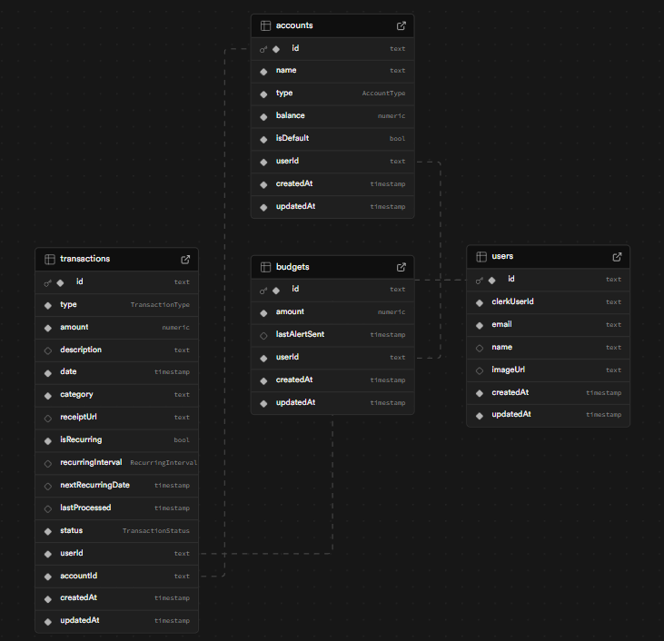

# 💸 Finsync – Your AI-Powered Finance Assistant 🚀

[](https://github.com/Rupesh-Piwal/finsync)   [](https://x.com/intent/follow?screen_name=rpmarch21)

**Finsync** is a cutting-edge finance management platform that leverages AI to automate your transaction tracking, budgeting, and monthly reporting. Built with the latest full-stack tools and deployed on **Vercel**, Finsync is secure, fast, and feature-rich.

[](https://finsyncai.vercel.app)

## Demo



#### LIVE DEMO 👉🏻 [Click to visit FinSync](https://finsyncai.vercel.app/)

#### PORTFOLIO 👉🏻 [View My Portfolio](https://rupesh-piwal-portfolio.vercel.app)

#### 🤝 Connect With Me

[](https://www.linkedin.com/in/rupesh-piwal21/) [](https://github.com/Rupesh-Piwal) [](https://x.com/rpmarch21)

---

## 🎯 Key Features

### 🧠 AI-Powered Tools

- AI Receipt Scanner – Upload and auto-fill transaction data.
- Monthly Spending Summaries – Intelligent analysis and suggestions.
- Auto-categorization of transactions using LLM.

### 📊 Financial Dashboard

- Bar charts, pie charts, and filters.
- Transaction history, sorting, and search.
- Budget progress indicators.

### 🔄 Automation with Inngest

- Monthly report email jobs.
- Recurring transaction automation.
- Budget threshold alerts with email notifications.

### 💾 Account & Transaction Management

- Create/Edit/Delete accounts and transactions.
- Bulk delete operations.
- Switch between multiple accounts.

### 🔒 Security & Performance

- Auth powered by **Clerk**.
- Rate limiting and bot protection via **Arcjet**.
- Protected API routes and secure session management.

---

## 🗂️ Database Schema

Visual overview of the core tables (Accounts, Transactions, Budgets, Users, etc.)



---

## 🛠️ Technologies Used

### 🧩 Full Stack

| Layer      | Stack                                       |
| ---------- | ------------------------------------------- |
| Frontend   | Next.js 15, TypeScript, Shadcn UI, Tailwind |
| Backend    | API Routes, Prisma, Node.js                 |
| Auth       | Clerk                                       |
| AI         | Gemini (via Google AI API)                  |
| Jobs       | Inngest (CRON-based automation)             |
| Security   | Arcjet (rate limiting, bot detection)       |
| DB         | PostgreSQL                                  |
| DevEnv     | Docker                                      |
| Deployment | Vercel                                      |

---

## 🚀 Getting Started

### Clone & Install

```bash
git clone https://github.com/Rupesh-Piwal/finsync.git
cd finsync
npm install
```

### Setup Environment

```env
DATABASE_URL=your_postgres_url
CLERK_PUBLISHABLE_KEY=your_clerk_key
CLERK_SECRET_KEY=your_clerk_secret
NEXT_PUBLIC_ARCJET_TOKEN=your_arcjet_token
GEMINI_API_KEY=your_gemini_key
INNGEST_EVENT_KEY=your_inngest_key
```

### Prisma Setup

```bash
npx prisma migrate dev --name init
npm db:seed
```

### Run with Docker

```bash
docker-compose up --build
```

---

## 🤖 AI Features

- **Receipt Parsing (Gemini API)** – Extract merchant, total, date, etc.
- **Monthly Insights (LLM)** – AI-generated summaries of user spending.
- **Auto Categorization** – Smart categorization of expenses.

---

## 📤 Deployment (Vercel)

- Import the repo into [Vercel](https://vercel.com/).
- Set all environment variables.
- Deploy and monitor via Vercel Dashboard.

---

## 🤝 Contributing

Contributions are welcome!

1. Fork the repository
2. Create a feature branch (`git checkout -b feat/your-feature`)
3. Commit your changes
4. Push to GitHub
5. Create a Pull Request

Feel free to reach out to me for guidance or collaboration:

[](mailto:rpiwal02@gmail.com)

---
