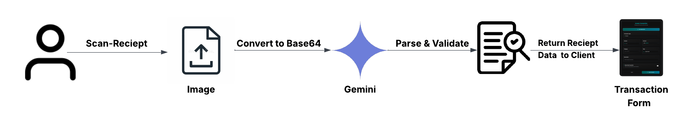
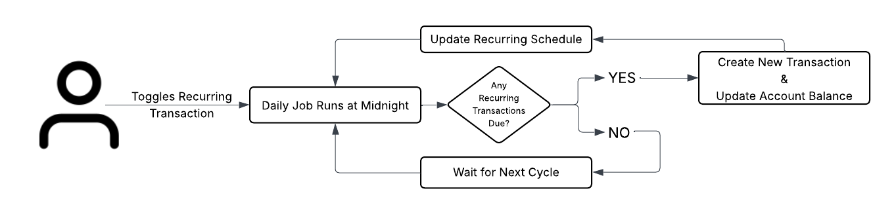
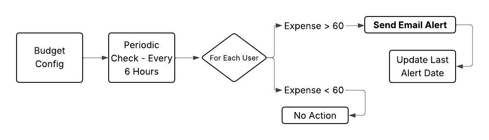

# 💸 Finsync – Your AI-Powered Finance Assistant 🚀

[](https://github.com/Rupesh-Piwal/finsync)   [](https://x.com/intent/follow?screen_name=rpmarch21)

**Finsync** is a cutting-edge finance management platform that leverages AI to automate your transaction tracking, budgeting, and monthly reporting. Built with the latest full-stack tools and deployed on **Vercel**, Finsync is secure, fast, and feature-rich.

[](https://finsyncai.vercel.app)

## Demo


#### LIVE DEMO 👉🏻 [Click to visit FinSync](https://finsyncai.vercel.app/)

#### PORTFOLIO 👉🏻 [View My Portfolio](https://rupesh-piwal-portfolio.vercel.app)

#### 🤝 Connect With Me

[](https://www.linkedin.com/in/rupesh-piwal21/) [](https://github.com/Rupesh-Piwal) [](https://x.com/rpmarch21)

---

## 🎯 Key Features

### 🧾 AI Receipt Scanner
  
Upload a receipt and let Gemini 1.5 Flash extract:
- Amount, date, merchant, description, and category  
- Auto-fills the form for quick entry

---
### 🔁 Recurring Transaction Automation  


- Users mark transactions as recurring (daily/weekly/monthly)  
- Scheduled job checks and auto-adds them on due dates  
- Updates account balance and next due date

---

### 🚨 Budget Threshold Alerts  

- Users define budgets by category  
- Every 6 hours, the system checks spending  
- If >60% used, sends email alerts  
- Prevents repeated alerts within the same month

---

## 🔒 Security Layer: Clerk+Acjet Protection

- Secure authentication via **Clerk**  
- Rate limiting and bot protection with **Arcjet**  
- All sensitive routes are protected and session-aware

---

## 🗂️ Database Schema

Visual overview of the core tables (Accounts, Transactions, Budgets, Users, etc.)


---

## 🛠️ Technologies Used

### 🧩 Full Stack

| Layer      | Stack                                       |
| ---------- | ------------------------------------------- |
| Frontend   | Next.js 15, TypeScript, Shadcn UI, Tailwind |
| Backend    | API Routes, Prisma, Node.js                 |
| Auth       | Clerk                                       |
| AI         | Gemini (via Google AI API)                  |
| Jobs       | Inngest (CRON-based automation)             |
| Security   | Arcjet (rate limiting, bot detection)       |
| DB         | PostgreSQL                                  |
| DevEnv     | Docker                                      |
| Deployment | Vercel                                      |

---

## 🚀 Getting Started

### Clone & Install

```bash
git clone https://github.com/Rupesh-Piwal/finsync.git
cd finsync
npm install
```

### Setup Environment

```env
DATABASE_URL=your_postgres_url
CLERK_PUBLISHABLE_KEY=your_clerk_key
CLERK_SECRET_KEY=your_clerk_secret
NEXT_PUBLIC_ARCJET_TOKEN=your_arcjet_token
GEMINI_API_KEY=your_gemini_key
INNGEST_EVENT_KEY=your_inngest_key
```

### Prisma Setup

```bash
npx prisma migrate dev --name init
npm db:seed
```

### Run with Docker

```bash
docker-compose up --build
```

---

## 🤖 AI Features

- **Receipt Parsing (Gemini API)** – Extract merchant, total, date, etc.
- **Monthly Insights (LLM)** – AI-generated summaries of user spending.
- **Auto Categorization** – Smart categorization of expenses.

---

## 📤 Deployment (Vercel)

- Import the repo into [Vercel](https://vercel.com/).
- Set all environment variables.
- Deploy and monitor via Vercel Dashboard.

---

## 🤝 Contributing

Contributions are welcome!

1. Fork the repository
2. Create a feature branch (`git checkout -b feat/your-feature`)
3. Commit your changes
4. Push to GitHub
5. Create a Pull Request

Feel free to reach out to me for guidance or collaboration:

[](mailto:rpiwal02@gmail.com)

---
